# fetcher module

This documention is composed of input classes, followed by returned classes - sorted from the outermost to the innermost.
Also, "external members" and "external methods" refer to the attributes and functions that users may use, while internal mechanisms are not detailed.

Several figures will be used along this document, here is a general caption describing how to read them.

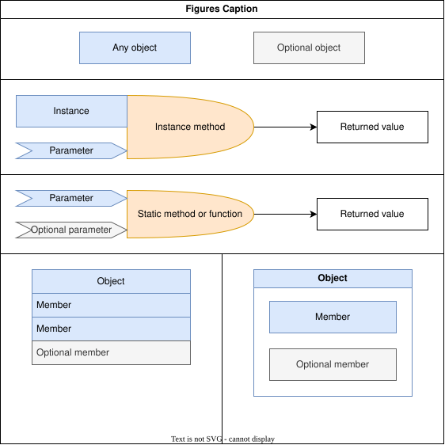

## Input classes

### RepositoryMetaData

Simple class holding all data needed to create a Repository object.

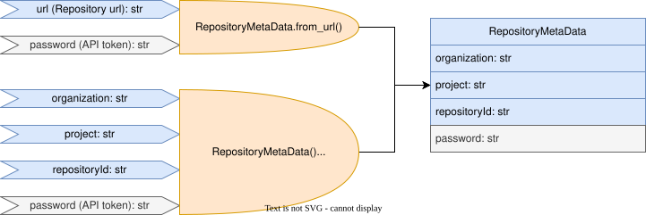

#### External members

|Member      |Type         |Description                   |
|:-----------|:------------|:-----------------------------|
|organization|str          |Azure Devops organization name|
|project     |str          |Azure Devops project name     |
|repositoryId|str          |Azure Devops repositoryId     |
|password    |Optional[str]|Azure Devops API token        |

#### External methods

##### ***RepositoryMetaData*** (\_\_init\_\_)

```
__init__(self, organization: str, project: str, repositoryId: str, password: Optional[str] = None)
```

Creates a RepositoryMetaData with provided values.

|Parameter   |Type         |Description                   |
|:-----------|:------------|:-----------------------------|
|organization|str          |Azure Devops organization name|
|project     |str          |Azure Devops project name     |
|repositoryId|str          |Azure Devops repositoryId     |
|password    |Optional[str]|Azure Devops API token        |

##### ***RepositoryMetaData.from_url*** (staticmethod)

```
from_url(url: str, password: Optional[str] = None) -> 'RepositoryMetaData'
```

Creates a RepositoryMetaData from the given url of an Azure Devops repository.

|Parameter|Type         |Description                      |
|:--------|:------------|:--------------------------------|
|url      |str          |url of an Azure Devops repository|
|password |Optional[str]|Azure Devops API token           |

Raises ValueError if url is malformed.

### PullRequestMetaData

Simple class holding all data needed to create a PullRequest object.

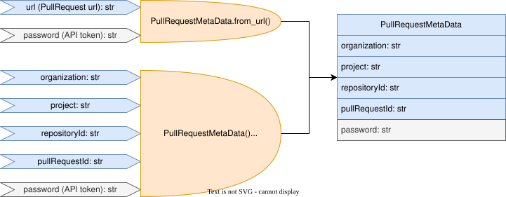

#### Inherited Classes

* RepositoryMetaData: As PullRequestMetaData is basically a RepositoryMetaData with a PullRequestId, it inherits from RepositoryMetaData. This inheritance indicates seamless integration wherever a RepositoryMetaData object is needed.

#### External members

|Member       |Type         |Description                   |
|:------------|:------------|:-----------------------------|
|organization |str          |Azure Devops organization name|
|project      |str          |Azure Devops project name     |
|repositoryId |str          |Azure Devops repositoryId     |
|pullRequestId|str          |Azure Devops pullRequestId    |
|password     |Optional[str]|Azure Devops API token        |

#### External methods

##### ***PullRequestMetaData*** (\_\_init\_\_)

```
__init__(self, organization: str, project: str, repositoryId: str, pullRequestId: str, password: Optional[str] = None)
```

Creates a PullRequestMetaData with provided values.

|Parameter    |Type         |Description                   |
|:------------|:------------|:-----------------------------|
|organization |str          |Azure Devops organization name|
|project      |str          |Azure Devops project name     |
|repositoryId |str          |Azure Devops repositoryId     |
|pullRequestId|str          |Azure Devops pullRequestId    |
|password     |Optional[str]|Azure Devops API token        |

##### ***PullRequestMetaData.from_url*** (staticmethod)

```
from_url(url: str, password: Optional[str] = None) -> 'PullRequestMetaData'
```

Creates a PullRequestMetaData from the given url of an Azure Devops repository.

|Parameter|Type         |Description                        |
|:--------|:------------|:----------------------------------|
|url      |str          |url of an Azure Devops pull request|
|password |Optional[str]|Azure Devops API token             |

Raises ValueError if url is malformed.

### UserDataBase

A cache/request API to get user name from id.
Behaves like a Dict[uid, name].

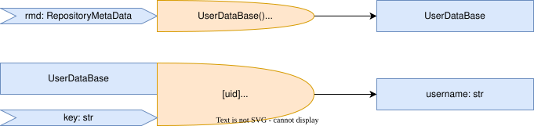

#### External members

None

#### External methods

##### ***UserDataBase*** (\_\_init\_\_)

```
__init__(self, rmd: RepositoryMetaData)
```

Creates a UserDataBase for a given organization (taken from the RepositoryMetaData).

|Parameter|Type              |Description                                   |
|:--------|:-----------------|:---------------------------------------------|
|rmd      |RepositoryMetaData|Provides organization name and request headers|

##### ***\_\_getitem\_\_***

```
__getitem__(self, key: str) -> str
```

Returns username for a given user id.
In case of error from the request, the uid is registered as the username and a warning is printed on the CLI.

|Parameter|Type|Description                     |
|:--------|:---|:-------------------------------|
|key      |str |Azure Devops user id            |

### FileDataBase

A cache/request interface to fetch file contents from the server for a given repository and commit id.
Behaves like a Dict[path, content].

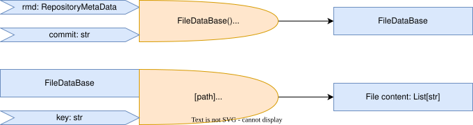

#### External members

None

#### External methods

##### ***FileDataBase*** (\_\_init\_\_)

```
__init__(self, rmd: RepositoryMetaData, commit: str)
```

Creates a FileDataBase tracking files of a given repository and commit id.

|Parameter|Type              |Description             |
|:--------|:-----------------|:-----------------------|
|rmd      |RepositoryMetaData|Repository information  |
|commit   |str               |Commit id               |

##### ***\_\_getitem\_\_***

```
__getitem__(self, path: str) -> List[str]
```

Returns the content of a given file as a list of lines.
In case of error from the request, the file is registered as empty and a warning is printed on the CLI.

|Parameter|Type|Description               |
|:--------|:---|:-------------------------|
|path     |str |Path of the requested file|

### VersionDataBase

A cache interface to store FileDataBase objects for different versions of a given repository.
Behaves like a Dict[commit_id, FileDataBase].


#### External members

None

#### External methods

##### ***VersionDataBase*** (\_\_init\_\_)

```
__init__(self, rmd: RepositoryMetaData)
```

Creates a VersionDataBase tracking versions of a given repository.

|Parameter|Type              |Description             |
|:--------|:-----------------|:-----------------------|
|rmd      |RepositoryMetaData|Repository information  |

##### ***\_\_getitem\_\_***

```
__getitem__(self, commit: str) -> FileDataBase
```

Returns the FileDataBase for a given commit.

|Parameter|Type|Description               |
|:--------|:---|:-------------------------|
|commit   |str |Commit id                 |

## Output classes

Overview:

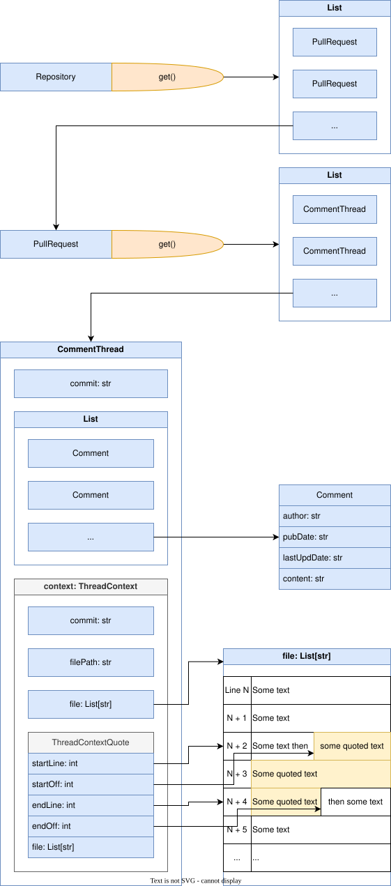

### Repository

A request interface to fetch the pull requests associated with a repository.

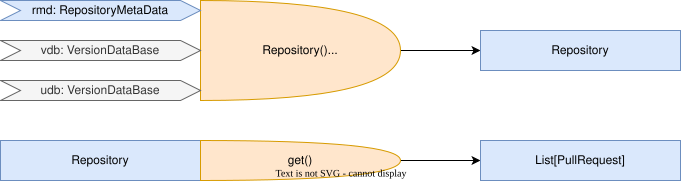

#### External members

None

#### External methods

##### ***Repository*** (\_\_init\_\_)

```
__init__(self, rmd: RepositoryMetaData, vdb: Optional[VersionDataBase] = None, udb: Optional[UserDataBase] = None)
```

Creates a Repository object.

|Parameter|Type                     |Description                                   |
|:--------|:------------------------|:---------------------------------------------|
|rmd      |RepositoryMetaData       |Repository information                        |
|vdb      |Optional[VersionDataBase]|Version database, a new one is created if None|
|udb      |Optional[UserDataBase]   |User database, a new one is created if None   |

##### ***get***

```
get(self) -> List[PullRequest]
```

Fetches pull requests from server, constructs PullRequest objects and return them in a list.

No parameter.

### PullRequest

A request interface to fetch and treat all threads and comments of a pull request.


#### External members

None

#### External methods

##### ***PullRequest*** (\_\_init\_\_)

```
__init__(self, prmd: PullRequestMetaData, vdb: Optional[VersionDataBase] = None, udb: Optional[UserDataBase] = None)
```

Creates a PullRequest object.

|Parameter|Type                     |Description                                   |
|:--------|:------------------------|:---------------------------------------------|
|prmd     |PullRequestMetaData      |Pull request information                      |
|vdb      |Optional[VersionDataBase]|Version database, a new one is created if None|
|udb      |Optional[UserDataBase]   |User database, a new one is created if None   |

##### ***get***

```
get(self) -> List[CommentThread]
```

Fetches pull request threads from server, analyses them to track version commits and returns a list of threads containing comments.

No parameter.

### CommentThread

Contains a comment along with its associated commit, context and replies.

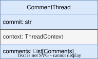

#### External members

|Member  |Type                   |Description                                  |
|:-------|:----------------------|:--------------------------------------------|
|commit  |str                    |Commit id on which the first comment was made|
|context |Optional[ThreadContext]|Context of the comment (file/quote)          |
|comments|List[Comments]         |Comment and replies                          |

#### External methods

None

### Comment

Text of a comment and various metadata.

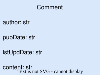

#### External members

|Member    |Type |Description                             |
|:---------|:----|:---------------------------------------|
|author    |str  |The author of the comment               |
|pubDate   |str  |The date the comment was first published|
|lstUpdDate|str  |The date the comment was last updated   |
|content   |str  |The comment content                     |

#### External methods

None

### ThreadContext

The file or file part concerned by the comment.

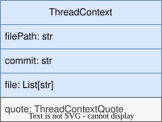

#### External members

|Member    |Type                        |Description                             |
|:---------|:---------------------------|:---------------------------------------|
|filePath  |str                         |The path of the commented file          |
|commit    |str                         |The version commit of the commented file|
|file      |List[str]                   |File content, as a list of lines        |
|quote     |Optional[ThreadContextQuote]|File part quoted by the comment         |

#### External methods

None

### ThreadContextQuote

Delimits the part of the file quoted by the comment.

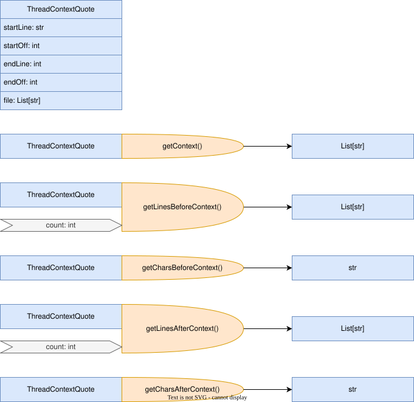

#### External members

|Member   |Type     |Description                                |
|:--------|:--------|:------------------------------------------|
|startLine|int      |Start line index of the quoted part        |
|startOff |int      |Start offset of the quoted part in the line|
|endLine  |int      |End line index of the quoted part          |
|endOff   |int      |End offset of the quoted part in the line  |
|file     |List[str]|File content, as a list of lines           |

#### External methods

##### ThreadContextQuote (\_\_init\_\_)

```
__init__(self, fc: DetailedFileContext, file: List[str])
```

Creates a ThreadContextQuote object from the given file context and file content.

|Parameter|Type               |Description                     |
|:--------|:------------------|:-------------------------------|
|fc       |DetailedFileContext|File context object             |
|file     |List[str]          |File content, as a list of lines|

##### getContext

```
getContext(self) -> List[str]
```

Get the quoted part as a list of lines.

##### getLinesBeforeContext

```
getLinesBeforeContext(self, count: int = 2) -> List[str]
```

Get _count_ lines above the quoted part as a list of lines.

|Parameter|Type|Description            |
|:--------|:---|:----------------------|
|count    |int |Desired number of lines|

##### getCharsBeforeContext

```
getCharsBeforeContext(self) -> str
```

Get the characters preceding the quoted part on its first line.

##### getLinesAfterContext

```
getLinesAfterContext(self, count: int = 2) -> List[str]
```

Get _count_ lines under the quoted part as a list of lines.

|Parameter|Type|Description            |
|:--------|:---|:----------------------|
|count    |int |Desired number of lines|

##### getCharsAfterContext

```
getCharsAfterContext(self) -> str
```

Get the characters following the quoted part on its last line.

## Known possible areas of improvement of the fetcher module

### VersionDataBase/FileDataBase

Currently, for more simplicity, the content of a file is fully downloaded for every commit on which a comment was made.
This happens even if the file didn't change between commits.
We could imagine a system which downloads and uses commits content to apply modifications to the files across versions instead of downloading it.

### Additionnal meta data

Some of the metadata provided by Azure devops are currently ignored. Some of them can be added on need.

### parentCommentId

Currently, comments in a thread are all displayed at the same hierarchy level (assuming first one is the initial comment and others are responses).
A more precise hierarchy of the comments could be provided by the script using the parentCommentId attribute of Comment objects.
